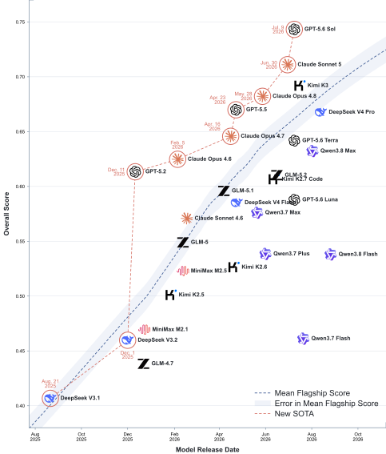

<p align="center">
  
</p>

<h1 align="center">TENGBench</h1>

<p align="center">
  面向摩擦纳米发电机科研场景的大语言模型分层测评基准
</p>

> 论文 *TENGBench: Can Large Language Models Understand, Reason about, and Design Triboelectric Nanogenerator-Based Sensors?* 的具体实现。

<p align="center">
  <a href="README.md">English</a> · <a href="#快速开始">快速开始</a> · <a href="#项目结构">项目结构</a>
</p>

## 新闻

- 📊 **[2026/09/11]** 发布 [TENGBench 完整数据集](https://huggingface.co/datasets/LMDHQ-0420/TENGBench)。
- 🚀 **[2026/09/01]** TENGBench 项目代码正式上线。

## 完整测评结果

<p align="center">
  
</p>

## 项目简介

TENGBench 从摩擦纳米发电机（TENG）论文中构建三层问题，并测评大语言模型的科研能力。

**Table 2. TENGBench task taxonomy.**

<table>
  <thead>
    <tr>
      <th>Layer</th>
      <th>Evaluation objective</th>
      <th>Subtask</th>
      <th>Evaluation scope</th>
    </tr>
  </thead>
  <tbody>
    <tr>
      <td rowspan="4">Fundamentals<br>(L1)</td>
      <td rowspan="4">Assess mastery of TENG fundamentals and performance metrics.</td>
      <td>Mechanisms</td>
      <td>Contact electrification, electrostatic induction, displacement current, and their governing conditions.</td>
    </tr>
    <tr>
      <td>Modes</td>
      <td>Principles and operating limits of contact-separation, sliding, single-electrode, and freestanding-layer modes.</td>
    </tr>
    <tr>
      <td>Polarity</td>
      <td>Triboelectric polarity, the triboelectric series, and surface-modification effects.</td>
    </tr>
    <tr>
      <td>Metrics</td>
      <td>Relationships and trade-offs among voltage, current, transferred charge, power, load, and impedance.</td>
    </tr>
    <tr>
      <td rowspan="4">Applied<br>Reasoning (L2)</td>
      <td rowspan="4">Assess inference of TENG performance changes from materials, structures, operating conditions, and experimental data.</td>
      <td>Material Effects</td>
      <td>Performance effects of material substitution, composition, doping, and surface treatment.</td>
    </tr>
    <tr>
      <td>Structural Effects</td>
      <td>Performance effects of geometry, layer count, electrode layout, and array architecture.</td>
    </tr>
    <tr>
      <td>Operating Conditions</td>
      <td>Performance effects of force, frequency, humidity, temperature, and environmental conditions.</td>
    </tr>
    <tr>
      <td>Multi-step Reasoning</td>
      <td>Multi-step synthesis of experimental observations and quantitative comparisons into consistent conclusions.</td>
    </tr>
    <tr>
      <td rowspan="2">Engineering<br>Design (L3)</td>
      <td rowspan="2">Assess engineering design of TENG devices and sensing systems.</td>
      <td>Layer Design</td>
      <td>Layer-by-layer selection of materials, thicknesses, interfaces, surface treatments, and stacking order.</td>
    </tr>
    <tr>
      <td>System Design</td>
      <td>End-to-end design of device architecture, arrays, packaging, signal conditioning, acquisition, processing, calibration, and decision-making.</td>
    </tr>
  </tbody>
</table>

## 测评模型配置

| 模型家族 | 当前测评配置覆盖 | 推理配置 |
| --- | --- | --- |
| GPT | GPT-5.2、GPT-5.5、GPT-5.6 Luna、Terra、Sol | `low`、`mid`、`max`、`xhigh` |
| Claude | Sonnet 4.6、Sonnet 5、Opus 4.6、4.7、4.8 | 服务商默认 |
| DeepSeek | V3.1、V3.2、V4 Flash、V4 Pro 0813 | 服务商默认 |
| Qwen | 3.7 Plus/Max/Flash、3.8 Max/Flash | 服务商默认 |
| Kimi | K2.5、K2.6、K2.7 Code、K3 | 服务商默认 |
| GLM | 4.7、5、5.1、5.2 | 服务商默认 |
| MiniMax | M2.1、M2.5 | 服务商默认 |

`evaluation/api/models.yaml` 中每个可运行的 API 配置遵循以下格式：

```yaml
配置名称:
  base_url: https://api.example.com/v1
  api_key_env: PROVIDER_API_KEY
  model: 服务商模型名称
  enable_thinking: false
```

配置名称同时也是结果目录名称。被测模型和 L3 裁判模型可以使用不同配置。

## 项目配置

- Python 3.10 或更高版本
- API 测评需要兼容 OpenAI Chat Completions 的接口
- Agent 流程需要 Codex，并安装仓库中的对应 Skill

## 快速开始

创建隔离环境并安装依赖：

```bash
git clone git@github.com:LMDHQ-0420/TENGBench.git
cd TENGBench
python3 -m venv .venv
source .venv/bin/activate
python -m pip install -r requirements.txt
```

### 生成 QA 基准

先创建本地工作目录，将论文 PDF 放入 `papers/inbox/`，并把 `qa-generation/skills/` 中的三个 Skill 安装或链接到 Codex。编排流程依次执行：

```bash
python qa-generation/scripts/orchestrator/distribute_papers.py
# 在 Codex 中运行 TENGBench-reviewer-writer，处理已分发论文。
python qa-generation/scripts/orchestrator/collect_and_route.py
python qa-generation/scripts/orchestrator/update_master.py
# 如需抽样质检，在 Codex 中运行 TENGBench-qa-validator。
python qa-generation/scripts/orchestrator/assemble_benchmark.py
```

### 运行 API 测评

```bash
cp evaluation/api/models.example.yaml evaluation/api/models.yaml
export OPENAI_API_KEY="your-key"
python evaluation/api/api_test.py
python evaluation/api/run.py --model gpt-example --judge gpt-example
```

只要题集中包含 L3，`--judge` 就是必填参数。程序支持按题断点续跑，结果写入本地 `result/<配置名称>/`。

### 运行 Skill 测评

将 `evaluation/skill/skills/` 中的 Skill 安装到 Codex，先运行 `tengbench-test-orchestrator` 完成答题，再运行 `tengbench-judge-orchestrator` 评审待处理的 L3 答案。两个流程只通过 `evaluation/skill/scripts/` 下的受控读写脚本访问题目和结果。

## 项目结构

```text
TENGBench/
├── asset/                       # README 公开资源
├── qa-generation/
│   ├── scripts/                 # 论文分发、QA 校验、基准组装
│   └── skills/                  # 编排、论文审阅出题、QA 质检 Skill
├── evaluation/
│   ├── api/                     # 并发 API 测评与契约测试
│   └── skill/                   # Codex Skill 测评、受控读写与测试
├── requirements.txt
├── README.md
└── README-ZH.md
```

## 测试

```bash
python -m unittest discover -s evaluation/api/tests
python -m unittest discover -s evaluation/skill/tests
```
