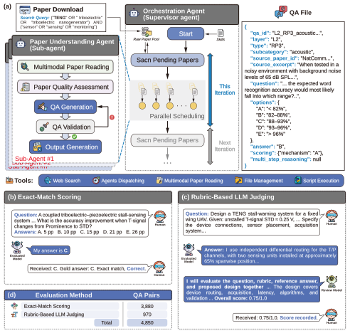

<p align="center">
  
</p>

<h1 align="center">TENGBench</h1>

<p align="center">
  A layered benchmark for evaluating large language models on triboelectric nanogenerator research.
</p>

> Official implementation of the paper *TENGBench: Can Large Language Models Understand, Reason about, and Design Triboelectric Nanogenerator-Based Sensors?*

<p align="center">
  <a href="README-ZH.md">中文</a> · <a href="#quick-start">Quick start</a> · <a href="#project-structure">Project structure</a>
</p>

## News

- 📊 **[2026/09/11]** Released the [complete TENGBench dataset](https://huggingface.co/datasets/LMDHQ-0420/TENGBench).
- 🚀 **[2026/09/01]** Released the TENGBench project source code.

## About

TENGBench evaluates whether large language models can understand, reason about, and design triboelectric nanogenerator-based sensors. A multi-agent framework constructed 4,850 traceable question-answer pairs from 485 papers across 32 journals, covering 10 subtasks in fundamentals, applied reasoning, and engineering design. The benchmark evaluated 29 open- and closed-source models from seven providers through 140,650 independent question-answer runs.

Across all models, the mean overall score was 0.5819 and the best score was 0.7432. Mean scores decreased from 0.6828 on fundamentals to 0.5733 on applied reasoning and 0.4894 on engineering design; the corresponding best scores were 0.8299, 0.7443, and 0.6554. Increasing reasoning effort from Low to X-high improved the overall scores of five GPT variants by 11.7%–13.3%.

## Full benchmark results

<p align="center">
  
</p>

## Dataset construction and evaluation

<p align="center">
  
</p>

The workflow covers paper screening, QA construction and validation, followed by API- and skill-based model evaluation.

## Overview

TENGBench builds and evaluates a three-layer question set derived from triboelectric nanogenerator (TENG) papers.

**Table 2. TENGBench task taxonomy.**

<table>
  <thead>
    <tr>
      <th>Layer</th>
      <th>Evaluation objective</th>
      <th>Subtask</th>
      <th>Evaluation scope</th>
    </tr>
  </thead>
  <tbody>
    <tr>
      <td rowspan="4">Fundamentals<br>(L1)</td>
      <td rowspan="4">Assess mastery of TENG fundamentals and performance metrics.</td>
      <td>Mechanisms</td>
      <td>Contact electrification, electrostatic induction, displacement current, and their governing conditions.</td>
    </tr>
    <tr>
      <td>Modes</td>
      <td>Principles and operating limits of contact-separation, sliding, single-electrode, and freestanding-layer modes.</td>
    </tr>
    <tr>
      <td>Polarity</td>
      <td>Triboelectric polarity, the triboelectric series, and surface-modification effects.</td>
    </tr>
    <tr>
      <td>Metrics</td>
      <td>Relationships and trade-offs among voltage, current, transferred charge, power, load, and impedance.</td>
    </tr>
    <tr>
      <td rowspan="4">Applied<br>Reasoning (L2)</td>
      <td rowspan="4">Assess inference of TENG performance changes from materials, structures, operating conditions, and experimental data.</td>
      <td>Material Effects</td>
      <td>Performance effects of material substitution, composition, doping, and surface treatment.</td>
    </tr>
    <tr>
      <td>Structural Effects</td>
      <td>Performance effects of geometry, layer count, electrode layout, and array architecture.</td>
    </tr>
    <tr>
      <td>Operating Conditions</td>
      <td>Performance effects of force, frequency, humidity, temperature, and environmental conditions.</td>
    </tr>
    <tr>
      <td>Multi-step Reasoning</td>
      <td>Multi-step synthesis of experimental observations and quantitative comparisons into consistent conclusions.</td>
    </tr>
    <tr>
      <td rowspan="2">Engineering<br>Design (L3)</td>
      <td rowspan="2">Assess engineering design of TENG devices and sensing systems.</td>
      <td>Layer Design</td>
      <td>Layer-by-layer selection of materials, thicknesses, interfaces, surface treatments, and stacking order.</td>
    </tr>
    <tr>
      <td>System Design</td>
      <td>End-to-end design of device architecture, arrays, packaging, signal conditioning, acquisition, processing, calibration, and decision-making.</td>
    </tr>
  </tbody>
</table>

## Evaluated model configurations

| Family | Configurations represented in the evaluation setup | Reasoning setup |
| --- | --- | --- |
| GPT | GPT-5.2, GPT-5.5, GPT-5.6 Luna, Terra, and Sol | `low`, `mid`, `max`, and `xhigh` variants |
| Claude | Sonnet 4.6, Sonnet 5, Opus 4.6, 4.7, and 4.8 | Provider default |
| DeepSeek | V3.1, V3.2, V4 Flash, and V4 Pro 0813 | Provider default |
| Qwen | 3.7 Plus/Max/Flash and 3.8 Max/Flash | Provider default |
| Kimi | K2.5, K2.6, K2.7 Code, and K3 | Provider default |
| GLM | 4.7, 5, 5.1, and 5.2 | Provider default |
| MiniMax | M2.1 and M2.5 | Provider default |

Every runnable API entry in `evaluation/api/models.yaml` uses this schema:

```yaml
configuration-name:
  base_url: https://api.example.com/v1
  api_key_env: PROVIDER_API_KEY
  model: provider-model-id
  enable_thinking: false
```

The configuration name is also the result directory name. The tested model and the L3 judge can use different entries.

## Requirements

- Python 3.10 or newer
- An OpenAI-compatible chat-completions endpoint for API evaluation
- Codex with the repository skills installed for the agent-based workflows

## Quick start

Create an isolated Python environment and install the project dependencies:

```bash
git clone git@github.com:LMDHQ-0420/TENGBench.git
cd TENGBench
python3 -m venv .venv
source .venv/bin/activate
python -m pip install -r requirements.txt
```

### Generate the QA benchmark

Create the local working directories, put source PDFs in `papers/inbox/`, and install or link the three skills in `qa-generation/skills/` into Codex. The orchestrator runs the pipeline scripts in this order:

```bash
python qa-generation/scripts/orchestrator/distribute_papers.py
# Run TENGBench-reviewer-writer in Codex for the distributed papers.
python qa-generation/scripts/orchestrator/collect_and_route.py
python qa-generation/scripts/orchestrator/update_master.py
# Run TENGBench-qa-validator in Codex when sample validation is wanted.
python qa-generation/scripts/orchestrator/assemble_benchmark.py
```

### Run API evaluation

```bash
cp evaluation/api/models.example.yaml evaluation/api/models.yaml
export OPENAI_API_KEY="your-key"
python evaluation/api/api_test.py
python evaluation/api/run.py --model gpt-example --judge gpt-example
```

`--judge` is required when the benchmark contains L3 questions. Runs resume from completed question files and write local artifacts to `result/<configuration-name>/`.

### Run skill-based evaluation

Install the skills in `evaluation/skill/skills/` in Codex, then start the answer workflow with `tengbench-test-orchestrator`. After the model answers are saved, run `tengbench-judge-orchestrator` to score pending L3 responses. Both workflows use the guarded readers and writers under `evaluation/skill/scripts/`.

## Project structure

```text
TENGBench/
├── asset/                       # Public README assets
├── qa-generation/
│   ├── scripts/                 # Paper routing, QA validation, benchmark assembly
│   └── skills/                  # Orchestrator, reviewer/writer, QA validator
├── evaluation/
│   ├── api/                     # Concurrent API evaluator and contract tests
│   └── skill/                   # Codex skill evaluator, guarded I/O, tests
├── requirements.txt
├── README.md
└── README-ZH.md
```

## Tests

```bash
python -m unittest discover -s evaluation/api/tests
python -m unittest discover -s evaluation/skill/tests
```
